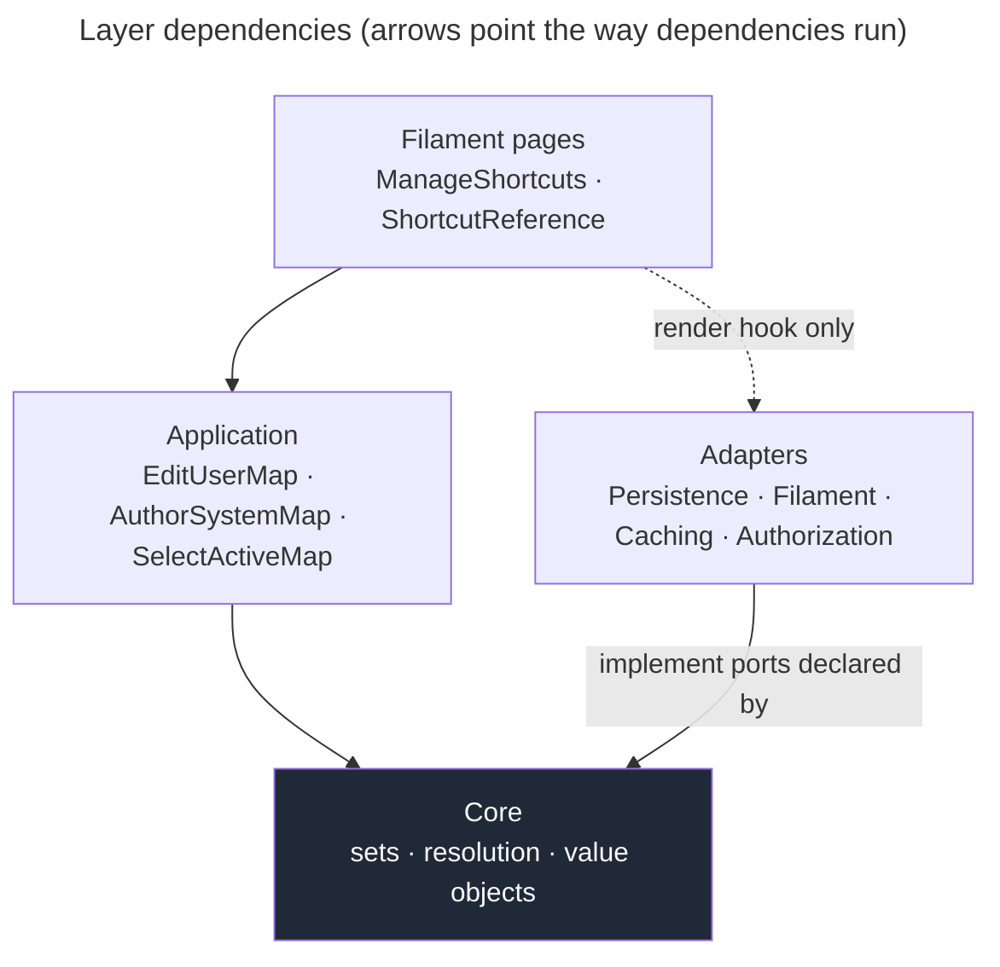
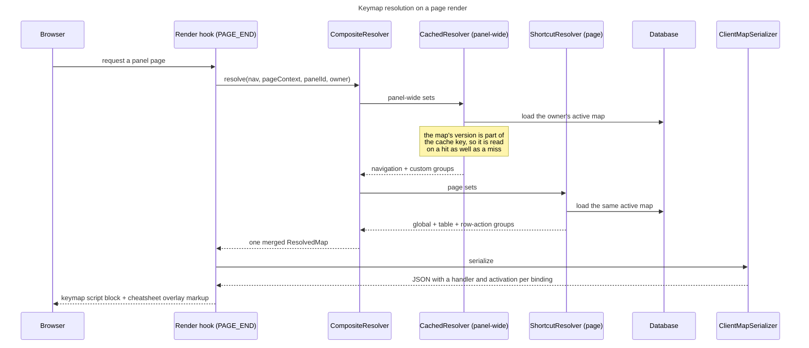

# Architecture

How the plugin is put together, and why it is shaped this way. Read this before changing anything in
`src/Core`, which is where the decisions with the widest blast radius live.

The package ships as a Filament v5 panel plugin, but the shortcut logic knows nothing about Filament.
Everything Filament-specific sits behind a port, which is what lets the resolution rules be tested
against plain arrays instead of a booted panel.

## Layers

`src/Core` is pure PHP: value objects, the set definitions, and the resolution pipeline. It has no
framework imports and no knowledge of URLs, CSS selectors, Eloquent, or the container. Everything it
needs from the outside world arrives through an interface it declares itself.

`src/Application` holds the use cases an interface calls into — editing a personal map, authoring a
shared one, selecting which map is active. This is where authorization and mode checks live, so every
caller gets them whether it is the shipped UI or a host's own controller.

`src/Persistence`, `src/Filament`, `src/Caching`, and `src/Authorization` are adapters. They implement
the core's ports against Eloquent, a Filament panel, Laravel's cache, and Laravel's gate.

The core never points outward. An adapter may depend on the core; the core may not depend on an
adapter. If you find yourself wanting an `Illuminate\` import inside `src/Core`, the thing you need
is a new port.

## Ports and their adapters

| Port | Declared in | Shipped adapter |
|---|---|---|
| `MapRepository` | `Core/Contracts` | `Persistence\EloquentMapRepository` |
| `MapEditor` | `Core/Contracts` | `Persistence\EloquentMapRepository` (same instance) |
| `SystemMapAuthor` | `Core/Contracts` | `Persistence\EloquentSystemMapAuthor` |
| `ListMaps`, `MapSelector` | `Core/Contracts` | `Persistence\EloquentMapCatalog` (same instance) |
| `NavigationProvider` | `Core/Contracts` | `Filament\FilamentNavigationProvider` |
| `PageContextProvider` | `Core/Contracts` | `Filament\FilamentPageContextProvider`, `NullPageContextProvider` |
| `Resolver` | `Core/Contracts` | `Core\Resolution\ShortcutResolver`, `CompositeResolver`, `Caching\CachedResolver` |
| `AuthorityGate` | `src/Authorization` | `Authorization\ConfigAuthorityGate` |

`MapRepository` and `MapEditor` are deliberately separate interfaces over one class: readers depend
only on the read contract, so nothing that merely resolves a keymap can accidentally write. The same
split applies to `ListMaps` and `MapSelector`.

`SystemMapAuthor` is separate from `MapEditor` for a sharper reason. `MapEditor` forks a personal copy
before writing; `SystemMapAuthor` mutates a shared preset in place. Those are different operations
with different risks, and folding them into one interface would let a caller reach the dangerous one
while asking for the safe one.

## Resolving a keymap for one page render

The hook runs at `PanelsRenderHook::PAGE_END` and nowhere else. Layout-level hooks fire outside the
page's Livewire component, where `Livewire::current()` returns null and the page-scoped sets cannot be
discovered at all.

Sets are also constructed per render rather than at plugin registration, because a panel's text
direction depends on the request locale and locale middleware runs long after plugins register.

## The two-registry split

Sets are divided by whether their contents depend on the current page.

**Panel-wide** — `NavigationSet` and `CustomSet`. Identical on every page of a panel, so the result is
cached.

**Page** — `GlobalSet`, `TableSet`, `RowActionSet`, and `PageSet`. Different per page and cheap to
build, so they are resolved fresh every time.

`CompositeResolver` concatenates the two results. That is only sound because the registries share no
set key, which is an invariant maintained by the plugin's wiring rather than enforced in `merge()`.

The cache key is a fingerprint over the panel id, the navigation version token, the active map's
identity (`type:id:version`), a hash of the config overlay, and the locale. It deliberately does not
include user identity: two admins on the same map share one entry. It equally deliberately does not
include permissions, for the reason below.

A finite cache lifetime ships by default. The fingerprint guarantees freshness on its own, but it
guarantees it by *changing key*, and nothing deletes the key it moved away from. The lifetime is what
reclaims those.

## The keymap is public

Every registered page produces a shortcut, whether or not the current user may reach it. This is the
single most counter-intuitive decision in the package, so it is worth stating plainly.

Authorization happens when a shortcut fires, never when the map is built. A shortcut triggers a real
Filament control: an unauthorized control is not rendered, and an unauthorized route is blocked by
middleware, so firing the shortcut does nothing. Filtering the map by permission would buy no security
and would cost a per-user cache entry keyed on a permission fingerprint that is difficult to
invalidate correctly.

The practical consequence is that a keymap reveals which pages *exist*, not what the user may do. If
the existence of a page is itself sensitive, that page does not belong in a panel's navigation.

## Where to start reading

- `Core/Resolution/ShortcutResolver` — the pipeline every binding passes through. See `resolution.md`.
- `Core/Sets/*` — one class per set, each deciding what it discovers and its default key style.
- `Persistence/EloquentMapRepository` — copy-on-write and the concurrency handling. See `domain-model.md`.
- `FilamentShortcutKeysPlugin` — the wiring: registries, resolver construction, and the render hook.
