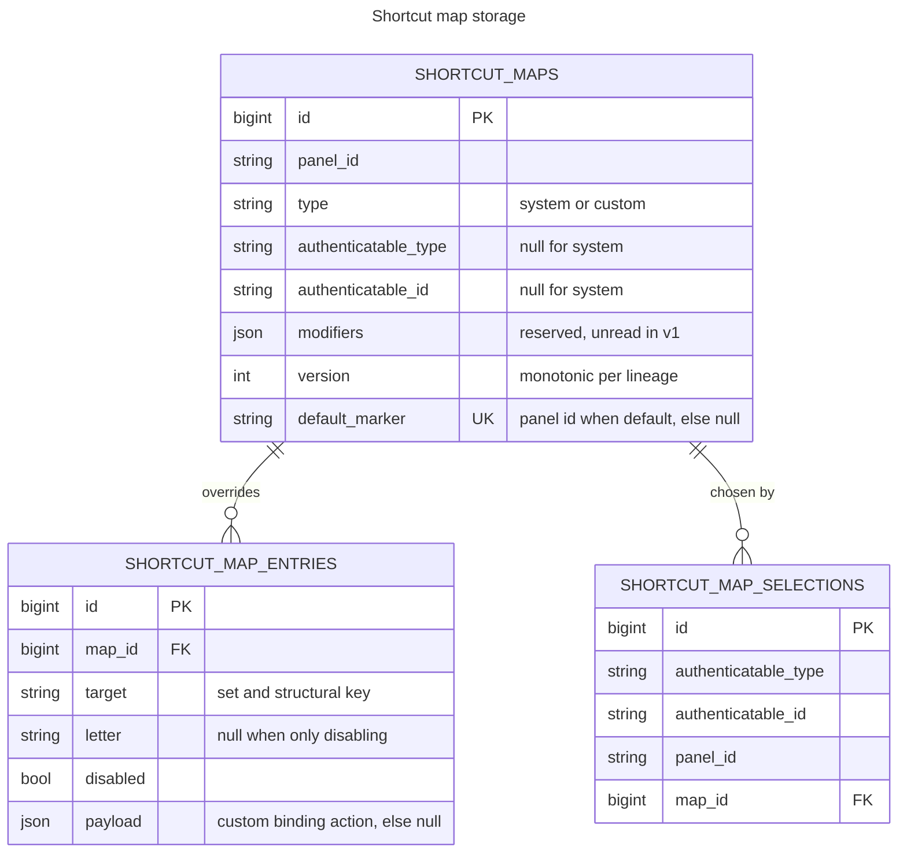
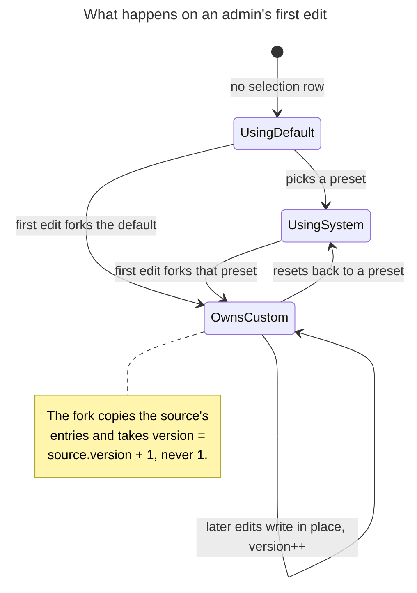

# Domain model

Three tables, three invariants, and one operation that has to be right under concurrency. If you are
changing anything about how maps are stored or forked, read the invariants section first — each one is
enforced by a database constraint chosen to behave the same on MySQL, PostgreSQL, and sqlite.

## Schema

The owner is polymorphic and stored as two plain strings, because host applications key users by
integer, UUID, or ULID and the core treats the id as opaque. Both columns are capped at 191 characters
to stay inside MySQL's utf8mb4 index-length limit.

A map stores **only differences**. Anything a map does not mention falls through to the live
convention engine, which is what lets a newly added resource appear in an admin's customised map
without touching their stored rows.

`modifiers` is reserved and currently read by nothing. The per-map modifier override was cut from v1;
the column is kept so the feature needs a resolver change and no migration.

## Invariants

**One active map per admin per panel.** A unique index over
`(authenticatable_type, authenticatable_id, panel_id)` on the selections table. This constraint is
also the serialization point for the fork operation described below, so it is doing more work than it
appears to.

**One default system map per panel.** Enforced with a nullable marker rather than a partial index:
`default_marker` holds the panel id for the default map and null otherwise, with a plain unique index
over the column. Every supported driver permits multiple nulls in a unique index, whereas filtered or
partial indexes are not portable — MySQL has none.

**One override per target per map.** A unique index over `(map_id, target)`. Its leftmost prefix also
serves lookups by `map_id`, so no standalone index on that column is needed.

The selections table does carry an explicit index on `map_id`, because PostgreSQL does not index
foreign key columns automatically and both the cascade delete and the fork's cleanup path filter by it.

## Copy-on-write

An admin never edits a shared map. The first write forks it.

Versions are monotonic per lineage rather than restarting at 1. A fork that reset to 1 would collide
with the system map's own version 1 for the same admin, and since the version is part of the cache
identity, the two different maps would resolve to the same cache key.

Every content change bumps the version. That is what busts the cache, so an edit that skipped the bump
would serve the pre-edit keymap until something else changed.

## The fork race

Two near-simultaneous first edits by the same admin must produce exactly one custom map and lose
neither edit. How that is achieved depends on whether a selection row already exists.

**A selection exists.** It is locked with `lockForUpdate` and repointed. A concurrent fork blocks on
the row lock until the first commits. No ambiguity.

**No selection exists.** There is no row to lock, so the unique constraint is the serialization point:
both requests build a custom map, both try to claim the slot with a plain insert, and the loser catches
the violation, discards its now-redundant map, and converges on the winner's.

That recovery is wrapped in a savepoint, and it must stay that way. PostgreSQL abandons the entire
transaction after any failed statement, so without the savepoint the loser's cleanup and lookup would
run inside a transaction the server had already given up on, raising `25P02` and losing the edit
instead of converging. This was a real defect, not a hypothetical — see `tests/Concurrency/ForkRaceTest.php`.

Drivers reach the same outcome by different routes, which is worth knowing before you write a test for
this. On PostgreSQL a `SELECT ... FOR UPDATE` matching no row locks nothing, so both requests proceed
and the constraint decides. InnoDB gap-locks the range instead, so the second request simply waits.
The consequence for testing is that the race cannot be driven from a single process on MySQL: the
second connection waits on the first, while the first waits for the test to return.

## Targets and stable identity

A binding's identity is `set:structureKey` — for example
`navigation:App\Filament\Resources\OrderResource` or `row-action:approve`. The structural key is a
class name or a stable action name, never a slug or a label.

That is what lets a stored override survive both renaming and reordering. It also means an override can
outlive the thing it points at, which is why the package ships `shortcut-keys:prune` rather than
deleting rows automatically: outside a request the command cannot distinguish "this action was removed"
from "this action is not on this page", so it only removes overrides whose target it can positively
prove is gone.
