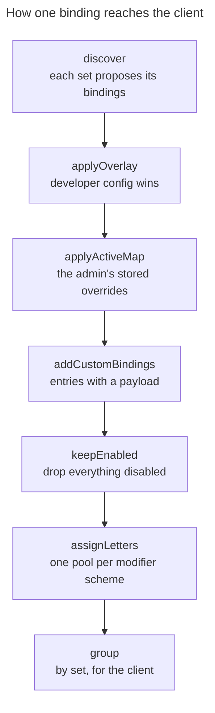

# Resolution

How a set of registered resources becomes a keymap the browser can act on. This is the part of the
package with the most rules per line, so it is worth understanding the order before changing a stage.

## The pipeline

`ShortcutResolver::resolve()` runs seven stages in a fixed order. Order matters at almost every step.



**discover** asks every registered set what it wants to bind. A set that finds nothing applicable to
the current page returns an empty list — `TableSet` on a page with no table, `RowActionSet` where the
table exposes none of the registered names.

**applyOverlay** applies the developer's config. A forced letter is turned into a fixed key combination
immediately, before assignment, so the assigner routes everything else around it. A disable is only
flagged here, not removed.

**applyActiveMap** applies the admin's stored overrides the same way. Targets the map does not mention
pass through untouched, which is what makes a stored map a set of differences rather than a snapshot.

**addCustomBindings** adds entries that carry a payload and have no convention binding — these are new
keys, not overrides. Only a set marked `AcceptsCustomBindings` accepts them, which stops a payload
attached to, say, a table target from displacing a real shortcut.

**keepEnabled** drops everything flagged disabled. It runs *before* assignment on purpose: a disabled
shortcut's letter returns to the pool instead of being reserved for something invisible.

**assignLetters** pools bindings by their effective modifier scheme and assigns within each pool, since
only bindings sharing a scheme can collide. Each pool takes the first free letter from the target's
label, then falls back through the alphabet. Bindings that already hold a forced combination keep it
and are simply routed around.

**group** buckets the result by set and attaches each set's scheme, giving the shape the serializer
turns into JSON.

## Modifier schemes

| Set | Default scheme | Notes |
|---|---|---|
| `navigation` | `Alt+Shift` | shares a letter pool with `custom` |
| `custom` | `Alt+Shift` | admin-defined bindings |
| `global` | `Alt` | current page's actions |
| `table` | bare | fixed keys, no letters assigned |
| `row-action` | bare | stable letters across the panel |
| `page` | bare | registered, emits nothing in v1 |

Schemes are configurable per set. A set the config never mentions keeps its convention, so removing a
line restores the default instead of silently turning shortcuts into bare keys. An unknown modifier
token throws rather than being ignored.

Two consequences of pooling by scheme are easy to trip over. Sets sharing a scheme share a pool, so
`navigation` and `custom` compete for letters with each other but never with `global`. And a set with
no modifier cannot accept a forced letter at all: `forcedCombo()` returns null for an empty scheme, so
a remap aimed at a table or row-action target is discarded at resolve time.

## Key matching

Keys are matched on the physical key (`event.code`), not the produced character. A shortcut therefore
lands on the same physical key regardless of keyboard layout or text direction.

Pagination is the exception that proves the rule. In a right-to-left panel the arrows are swapped
server-side, because Filament flips its own previous and next controls, and a key that moved the wrong
way would be correct by physical position and wrong by meaning. Deciding it server-side also keeps the
reference page and the overlay showing the key that actually fires.

## Precedence

When one key could match more than one active set, the client resolves in a fixed order:

```
page > table > global > navigation
```

The page tier is inert in v1, since `PageSet` emits nothing. The overlay does not mark precedence
winners, because with the shipped sets on disjoint schemes and a shared letter pool, no two sets can
reach the same combination. That marking was written, found to be unreachable, and removed; it comes
back when a page can declare its own shortcuts.

## What the client receives

The render hook injects a JSON block containing, per group, the set key, the client handler that fires
it, the modifier, and the bindings. Each binding carries its target, its physical key code, and an
activation describing what to do: navigate to a URL, click a selector, or run a named table behaviour.

The split matters. The core stays free of URLs and selectors — it deals in targets and key
combinations — and `ClientMapSerializer` resolves those into something actionable using the same
providers that discovered them.

Handlers are keyed by set, but a set does not have to be fired by a handler of the same name.
`RowActionSet` has the key `row-action` and the handler `table`, because firing a row action needs the
table handler's focused-row cursor.

## Trigger-time authorization

A shortcut clicks a real Filament control or follows a real route. It never invents a privileged
action, and it never calls a Livewire method directly.

This is the whole security model, and it is why a custom binding's payload is restricted to exactly one
of a selector for an already-rendered element or a host-relative route. An unauthorized control is not
rendered, so there is nothing to click; an unauthorized route is stopped by middleware. A confirmation
modal appears because the real control was clicked, not because the plugin reimplemented one.
